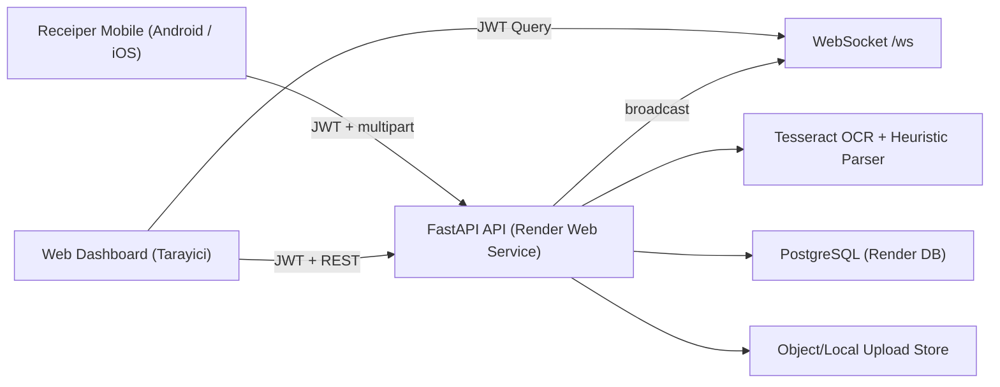

# Receiper SaaS Mimari Haritasi

## 1) Genel Mimari

## 2) Servis Sorumluluklari

- `Web Dashboard`: login, online tablo, QR/pair code, export to Excel.
- `Mobile`: login + pairing + fiş fotoğraf upload.
- `API`: auth, OCR pipeline, veritabanı yazımı, realtime bildirim.
- `PostgreSQL`: kullanıcı, cihaz, pairing code, fiş satırları.

## 3) Excel -> DB Dönusum Mantigi

Eski `excel_writer.py` içindeki kolon yapısı birebir veritabanına taşındı:

- `kod`
- `hesap_kodu`
- `evrak_tarihi_text` (+ normalize `evrak_tarihi`)
- `evrak_no`
- `vergi_tc_no`
- `gider_aciklama`
- `kdv_orani`
- `alinan_mal_masraf`
- `ind_kdv`
- `toplam`

Ek olarak analiz kolaylığı için:

- `merchant`
- `payment_type`
- `receipt_time`
- `raw_text`
- `source_image_path`
- `uploaded_at`

## 4) Auth ve Eslestirme

- Auth: JWT Bearer (`/api/auth/register`, `/api/auth/login`, `/api/auth/me`).
- Web kullanıcısı `POST /api/pairing-codes` ile kısa süreli eşleştirme kodu alır.
- Mobil kullanıcı login sonrası `POST /api/mobile/pair` ile aynı hesabın kodunu doğrular.
- Eşleşen cihazdan gelen fişler aynı kullanıcı hesabına yazılır.

## 5) Realtime Akis

- Web dashboard `/ws?token=<JWT>` ile bağlanır.
- Mobil upload sonrası backend DB kaydından sonra:
  - `event: "receipt.created"` payload’ı yayınlar.
- Dashboard tablo satırını anında başa ekler.

## 6) OCR Koruma Prensibi

Eski parser korunmuştur:

- EXIF orientation düzeltme
- Türkçe karakter folding
- çoklu preprocess/rotasyon scoring
- KDV/Toplam/Tarih/FişNo/VergiNo heuristics

Dosya: `backend/parser.py`

## 7) Deploy

- Docker image içinde Tesseract (`tur+eng`) kurulu.
- Render deploy dosyası: `render.yaml`
- Local dev orchestration: `docker-compose.yml`

